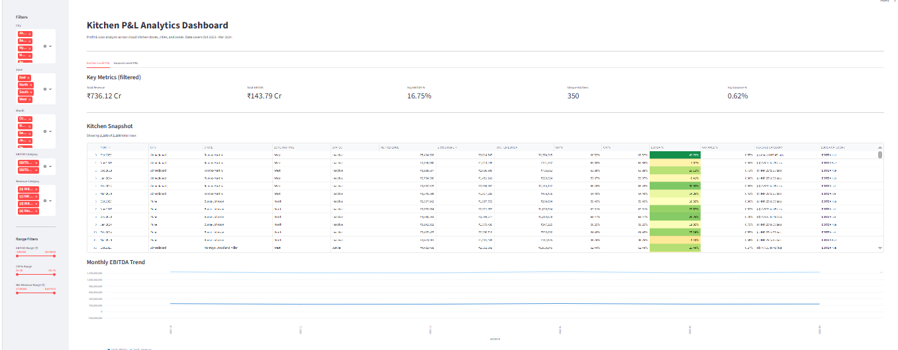
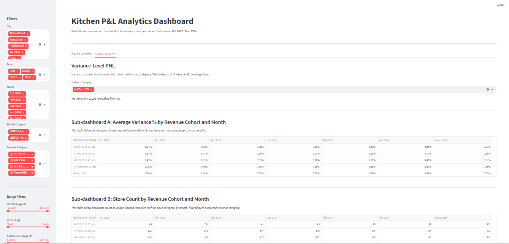

# Kitchen P&L Analytics Dashboard

A two-tab Streamlit dashboard analyzing cloud kitchen Profit & Loss data across 350 unique kitchen locations in 5 Indian cities, over a 6-month period (Oct 2023 – Mar 2024).

Built as part of a data analyst case study.

---

## Dashboard Preview

### Kitchen-Level PNL

### Variance-Level PNL

---

## Key Findings

The notebook (`notebooks/01_exploratory_analysis.ipynb`) walks through the full analysis. Four findings stand out:

**1. Store names are not unique identifiers.**
Initial duplicate checks flagged 36 (Month, Store) pairs. Investigation revealed these were not data errors — they represented brands operating from multiple kitchen locations. True unique kitchen identifier is `(MONTH, CITY, STORE, ZONE MAPPING)`. Dataset has 344 brand names but 350 distinct kitchen locations.

**2. STATUS does not correlate with profitability.**
Active and Inactive kitchens show statistically identical performance (EBITDA % differs by 0.4 points). The Inactive flag does not reflect financial distress — it likely captures operational state (paused, transition) that is not financially meaningful.

**3. City-level differences are within noise.**
EBITDA % across 5 cities spans only 1.6 percentage points (Mumbai 15.7% → Bangalore 17.3%). Profitability variance is driven at the individual kitchen level, not by geography.

**4. Variance (wastage) is a real driver of EBITDA.**
Correlation between Variance % and EBITDA % is -0.59 (strong negative). Correlation with NET REVENUE is -0.65 — smaller kitchens face structurally higher wastage. Notably, variance does not affect Gross Margin (-0.07) because GM is calculated from ideal food cost, not actual. Wastage hits below the GM line.

---

## Tech Stack

- Python 3.12.7
- pandas, numpy, openpyxl for data manipulation
- Streamlit and Plotly for the dashboard
- matplotlib for conditional formatting (heatmap on EBITDA %)
- Jupyter Notebook for exploratory analysis

---

## How to Run

### 1. Create and activate a virtual environment
### 2. Install dependencies
### 3. Place data file

Place `kitchen_pnl.xlsx` inside the `data/` folder.

If running for the first time, open and execute the notebook `notebooks/01_exploratory_analysis.ipynb` end-to-end. This produces the prepared dataset `data/kitchen_pnl_prepared.csv` that the dashboard reads.

### 4. Launch the dashboard
The dashboard opens at `http://localhost:8501`.

---

## Project Structure
---

## Dashboard Features

### Tab 1: Kitchen-Level PNL
- Filters (sidebar): City, Zone, Month, EBITDA Category, Revenue Category
- Range sliders: EBITDA, CM %, Net Revenue
- 5 KPI cards: Total Revenue, Total EBITDA, Avg EBITDA %, Unique Kitchens, Avg Variance %
- Kitchen Snapshot table with conditional formatting (red-yellow-green gradient on EBITDA %)
- Monthly EBITDA and Revenue trend chart
- Download filtered data as CSV

### Tab 2: Variance-Level PNL
- Variance Category filter at the top
- Sub-dashboard A: Average Variance % by Revenue Cohort × Month
- Sub-dashboard B: Unique Store Count by Revenue Cohort × Month, drillable by variance category

---

## Performance Optimization

The brief asks for performance optimization in case of real-time data refresh. The implementation uses:

- `@st.cache_data` on the data loading function — the CSV is read once on first load and held in memory; subsequent filter interactions reuse the cached DataFrame
- Data prep is done once in the notebook and saved to CSV; the dashboard does not re-compute derived metrics on every run

This keeps filter interactions sub-second even as the dataset scales.

---

## Known Limitations

- The brief's "Below INR 15 lacs" revenue cohort is empty in this dataset — the minimum monthly Net Revenue observed is ₹17.3 lacs. The bucket is preserved as required.
- All kitchens in the dataset fall in the `Var < 2%` variance category. The other three categories (2-3%, 3-5%, >5%) are exposed as filters but will return empty results until data with higher variance is introduced.
- Contribution Margin is treated as a proxy for Gross Margin since the dataset does not separately report variable operating costs.

---

## Assignment Done By

Rohit Kumar
7282060814
rohit2318kumar@gmail.com

